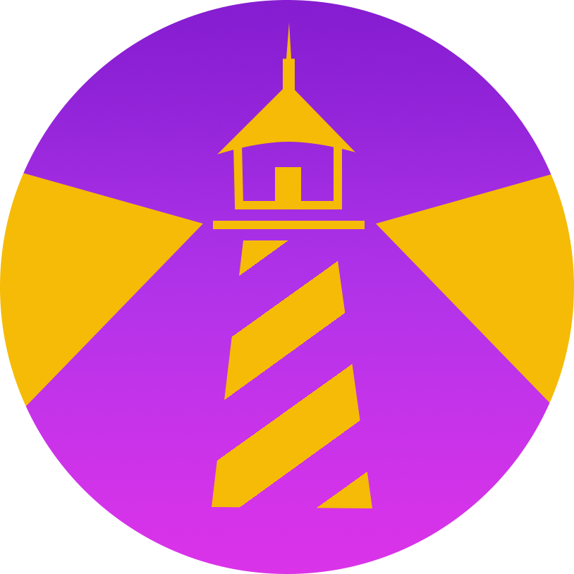

LightHouse - HackViolet 2022
(Best Hack to Support Women - 1st Place)

Devpost link: https://devpost.com/software/lighthouse-pz2tkj
Figma link: https://www.figma.com/file/J3bCpM2bWkDjye8IhJvtIv/LightHouse?node-id=2%3A200

## Inspiration
We have always been taught that **safety is the number one priority**. As we grow up and travel to different destinations, we may find ourselves in a situation where we have to travel at night but we don't feel safe. Although Google Maps shows users the quickest way to their destination, it isn’t always necessarily the safest way. That is where LIGHTHOUSE would come in handy! We want to provide a convenient and user-friendly application that guides users to their destinations with the safest and most well-lit route possible. 

## Functions and Features
The app's main function is to gather information about the location of street lights and devise a path for the user that has the most streetlights. The user will enter their destination and the app will figure out multiple different routes that the user can take. Some other features include quick access to emergency contacts, a fake call button, and an emergency hotline.

## How We Built Lighthouse
Our prototype was built on Figma where we created a mockup of what we wanted the final app to look like. To write the code itself, we used VS Code. We used the repositories on GitHub to keep our project organized. As for the app itself, the Google Maps API is used to figure out the many different possible routes the user can take to reach their destination. The Twilio API is used for the emergency contact and hotline features. 

## Challenges We Faced
One of the amazing things about HackViolet is that people all over the world can participate. Unfortunately, since we all live in different time zones, it has been difficult trying to find a convenient time for all of the four team members to get together and discuss the workings of the project. But with our great time management skills, we were able to come together as a team and work on Lighthouse!

## Accomplishments!
We wanted to take advantage of the features that the sponsors of HackViolet provided. We wanted to incorporate them in a way that made sense. We are very proud to have implemented the Twilio API into our program. 

## What We Learned
Some of the platforms that we used were new to some people so there was a learning curve. In addition, this was the first hackathon for many of the team members so it was a new experience trying to navigate a hackathon. But overall, we all had a lot of fun!

## What's Next for Lighthouse?
Our design at the moment is simple (white and purple for _HackVIOLET_), but we want to take the time to create a more cohesive and aesthetic theme for our app. In terms of additional features, users should be given the option to access ride-booking apps such as Uber or Lyft straight from the app if they cannot find a suitable route that is safe enough. Since security can always be improved, although we plan to implement Google sign-in in our app, we need a secure way to store the contact information and addresses that the user provides. 
